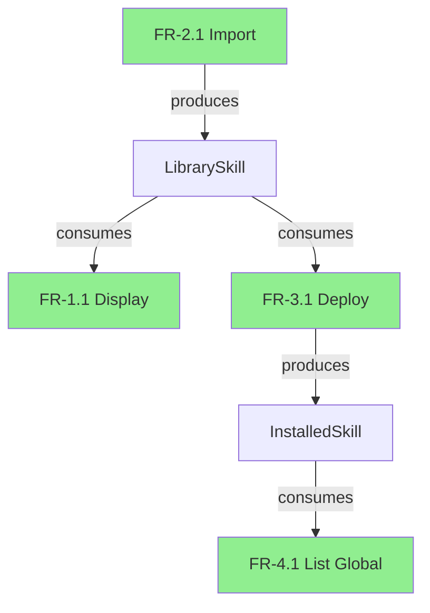

# Step 4: Report Generation

## Objective
Generate a comprehensive linkage analysis report with actionable recommendations.

## Instructions

### 4.1 Create Report Structure

Generate the report file at: `{planning_artifacts}/prd-linkage-analysis-report.md`

```markdown
---
title: PRD Linkage Analysis Report
prd: {prd-filename}
analyzedAt: {timestamp}
summary:
  totalRequirements: {total}
  closedChains: {closed}
  openChains: {open}
  brokenChains: {broken}
  closureRate: {percentage}
---

# PRD 链路闭环分析报告

## 📊 执行摘要

| 指标 | 数值 | 状态 |
|------|------|------|
| 总需求数 | {total} | — |
| 完全闭环 | {closed} | ✅ |
| 开环 (需补充) | {open} | ⚠️ |
| 断链 (需修复) | {broken} | ❌ |
| 闭环率 | {percentage}% | {status} |

**整体评估:** {assessment}

---

## 🔴 关键问题 (必须修复)

### {ID}: {Title}

**问题描述:** {description}

**缺失内容:**
- {missing item 1}
- {missing item 2}

**影响范围:** {impact}

**建议修复:**
```
{proposed fix}
```

---

## ⚠️ 警告问题 (建议审查)

### {ID}: {Title}

**问题描述:** {description}

**隐含假设:**
- {assumption 1}
- {assumption 2}

**建议:** {recommendation}

---

## ✅ 闭环验证详情

### 按模块统计

| 模块 | 总数 | 闭环 | 开环 | 断链 | 闭环率 |
|------|------|------|------|------|--------|
| FR-1 Library | 7 | 7 | 0 | 0 | 100% |
| FR-2 Import | 11 | 10 | 1 | 0 | 91% |
| FR-3 Deploy | 10 | 8 | 0 | 2 | 80% |
| ... | ... | ... | ... | ... | ... |

### 链路依赖图



---

## 📋 完整需求分析

{For each requirement, include the full Input-Processing-Output analysis}

---

## 🎯 改进建议优先级

### P0 - 阻塞性问题 (必须立即修复)
1. {issue}
2. {issue}

### P1 - 重要问题 (本迭代修复)
1. {issue}
2. {issue}

### P2 - 一般问题 (下迭代修复)
1. {issue}
2. {issue}

### P3 - 优化建议 (可选)
1. {suggestion}
2. {suggestion}

---

## 📝 附录

### A. 分析方法说明

本分析采用 Input-Processing-Output (IPO) 三维分析法:

1. **Input (前置条件/输入):** 分析每个需求执行前必须具备的条件和数据
2. **Processing (处理逻辑):** 分析需求执行过程中的业务逻辑和操作
3. **Output (结果):** 分析需求执行后产生的结果和副作用

链路闭环判定标准:
- ✅ **闭环:** Input 明确, Processing 完整, Output 被消费
- ⚠️ **开环:** Input 或 Output 存在未明确的隐含假设
- ❌ **断链:** Processing 缺失, 或 Output 无消费者

### B. 术语表

| 术语 | 定义 |
|------|------|
| 闭环 | 需求的输入输出形成完整链路 |
| 开环 | 链路存在隐含假设未明确 |
| 断链 | 链路中断, 缺少必要环节 |

---

*报告生成时间: {timestamp}*
*分析工具: bmad-prd-linkage-analysis*
```

### 4.2 Generate Visualizations

If mermaid diagrams are supported, generate:
1. Dependency graph
2. Data flow diagram
3. Module interaction diagram

### 4.3 Present Summary to User

```
✅ 分析完成！

📊 结果摘要:
- 总需求: {total}
- 闭环率: {percentage}%
- 关键问题: {critical} 个
- 警告问题: {warning} 个

📄 完整报告已保存至:
{report-path}

🔍 查看关键问题? (y/n)
```

### 4.4 Interactive Review (Optional)

If user wants to review issues:

```
🔴 关键问题列表:

[1] FR-3.6: Deployment tracking - Processing logic undefined
[2] FR-5.9: Auto-refresh - Input trigger not specified
...

选择问题编号查看详情，或输入 'q' 返回:
```

### 4.5 Completion

**Frontmatter Update:**
```yaml
stepsCompleted: ['step-01-prd-discovery', 'step-02-requirement-extraction', 'step-03-linkage-validation', 'step-04-report-generation']
reportPath: '{report-path}'
analysisComplete: true
```

Display completion message:

```
🎉 PRD 链路闭环分析完成！

报告位置: {report-path}

下一步建议:
1. 审查关键问题并修复 PRD
2. 运行 bmad-validate-prd 验证修复
3. 运行 bmad-check-implementation-readiness 检查实现准备度

感谢使用 bmad-prd-linkage-analysis!
```
